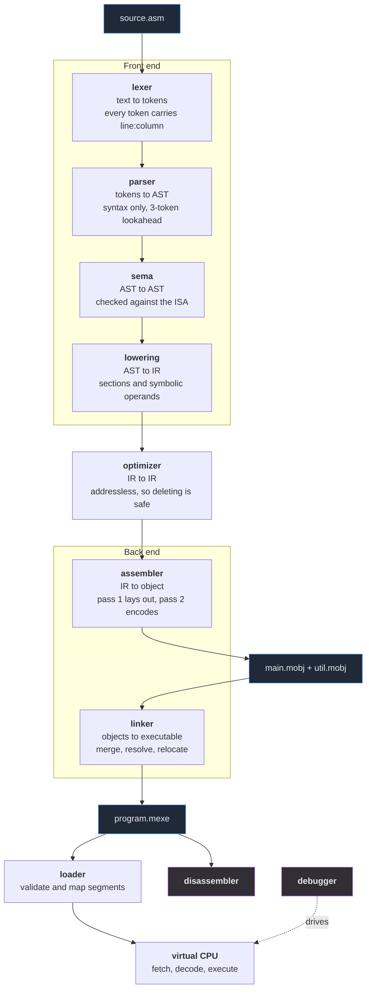
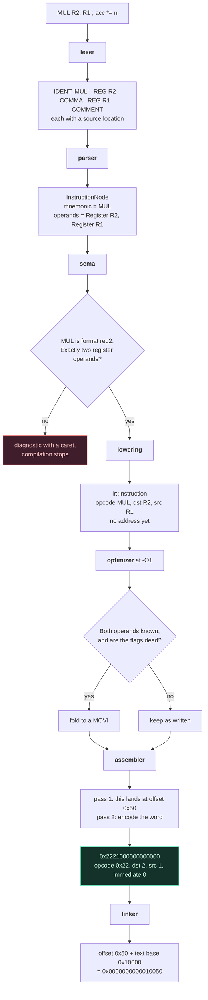
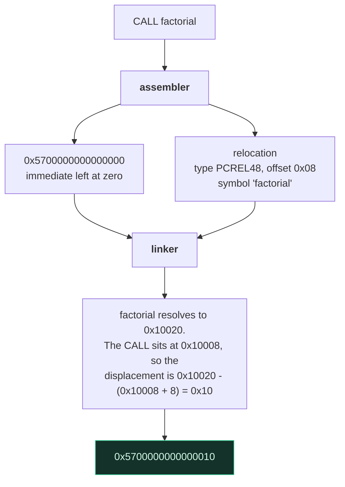

# MiniToolchain

A complete compiler toolchain for a custom 64-bit virtual instruction set,
written in C++23 with no third-party dependencies — in the build or in the
tests.

Assembly source goes in one end; a running program comes out the other, and
every stage in between is something you can inspect, disassemble, debug and
measure.

```asm
.section .text
.global _start

_start:
    MOVI R1, 40
    MOVI R2, 2
    ADD  R1, R2
    CALL print_number
    HALT

print_number:
    MOV R14, R1
    RET
```

```console
$ minitool build hello.asm -o hello.mexe
linked 1 object(s) -> hello.mexe (entry 0x10000, 56 bytes of image)

$ minitool disassemble hello.mexe
segment .text at 0x10000 (56 bytes, r-x)

0000000000010000 <_start>:
0000000000010000:  1110000000000028  MOVI R1, 40
0000000000010008:  1120000000000002  MOVI R2, 2
0000000000010010:  2012000000000000  ADD R1, R2
0000000000010018:  5700000000000008  CALL    print_number (0x10028)
0000000000010020:  0100000000000000  HALT

0000000000010028 <print_number>:
0000000000010028:  10E1000000000000  MOV R14, R1
0000000000010030:  5800000000000000  RET

$ minitool run hello.mexe --trace
PC=0x0000000000010000  MOVI R1, 40
PC=0x0000000000010008  MOVI R2, 2
PC=0x0000000000010010  ADD R1, R2
...
```

## Contents

- [What is here](#what-is-here)
- [Building](#building)
- [The toolchain](#the-toolchain)
- [The pipeline](#the-pipeline)
- [The ISA](#the-isa)
- [Binary formats](#binary-formats)
- [The optimizer](#the-optimizer)
- [The debugger](#the-debugger)
- [The playground](#the-playground)
- [Testing](#testing)
- [Performance](#performance)
- [Documentation](#documentation)
- [Limitations](#limitations)

## What is here

| Component | What it does |
|---|---|
| **Lexer** | Hand-written scanner with source locations and literal decoding |
| **Parser** | Recursive descent, three-token lookahead, line-level error recovery |
| **Semantic analysis** | Instruction shapes, operand kinds, literal ranges, duplicate labels |
| **IR** | An addressless intermediate representation, so optimization is safe |
| **Optimizer** | Constant folding, dead stores, unreachable code, peepholes — with FLAGS liveness over the control-flow graph |
| **Assembler** | Two passes: assign offsets, then encode and emit relocations |
| **Object format** | `.mobj` — sections, symbols, relocations, a line table, CRC-32 |
| **Relocation engine** | Five types, including two that patch instruction fields |
| **Linker** | Section merging, symbol resolution, address assignment, relocation |
| **Executable format** | `.mexe` — a validated memory image with debug metadata |
| **Virtual CPU** | 16 registers, flags, a permission-checked flat address space |
| **Syscalls** | `exit`, `write`, `read`, `allocate`, behind a substitutable provider |
| **Disassembler** | Shares the VM's decoder, so it cannot lie about what will run |
| **Debugger** | Breakpoints, watchpoints, stepping, backtraces, source mapping |
| **Diagnostics** | Carets, notes, stable error codes, recovery |
| **Playground** | A browser UI that drives the real pipeline over a local socket |

About 11,000 lines of implementation and 6,300 of tests: 358 test cases
across unit, integration, golden, property, fuzz and failure suites.

## Building

### With CMake (any of GCC 13+, Clang 17+, MSVC 19.40+)

```bash
cmake --preset release
cmake --build build/release
ctest --preset debug
```

### With nothing but Visual Studio Build Tools

```powershell
pwsh tools/build.ps1              # build everything and run the tests
pwsh tools/build.ps1 -NoTests     # build only
pwsh tools/build.ps1 -Filter vm   # run one group
```

This path exists because the project should be buildable on a machine with
no CMake and no network access. It locates MSVC through `vswhere` and
drives `cl` directly. Either host works — `powershell` (5.1, preinstalled
on Windows) and `pwsh` (7) produce the same output and the same exit code.

## The toolchain

```console
minitool build   <src...> -o <exe>     assemble and link in one step
minitool assemble <src>   -o <obj>     assemble one source file
minitool link    <obj...> -o <exe>     link object files
minitool run     <exe>                 execute a program
minitool disassemble <exe>             print the program as assembly
minitool debug   <exe>                 interactive debugger
minitool objdump <obj>                 describe an object file
minitool verify  <exe>                 validate an executable image
minitool isa                           print the instruction table
minitool decode  <hex-word>            decode one instruction word
minitool bench                         built-in benchmark
minitool serve                         browser playground on 127.0.0.1:8080
```

Useful flags: `-O0` / `-O1`, `-g` / `-gno`, `--entry <name>`, `--trace`,
`--stats`, `--max-instructions <n>`, `-x <debugger command>`,
`--port <n>` / `--host <addr>`.

## The pipeline

Source text goes in one end and a running program comes out the other.
Every box is a separate module, and every arrow is a data structure you
can inspect with the CLI.



Two pieces of code are shared on purpose, because a second copy would be
free to disagree: `isa::decode` (used by the assembler, disassembler,
relocation engine and VM) and `isa::evaluateBinary` (used by the VM's
execute step *and* the optimizer's constant folder).

### How one line becomes an instruction

Following `MUL R2, R1` from `examples/factorial.asm` through every stage.
The addresses and the encoding below are the real ones — check them with
`minitool decode 2221000000000000`.



A symbol operand needs one extra step. The assembler cannot know the
address yet, so it emits a **relocation** and leaves the field zero; the
linker patches it once every section has an address.



That `+ 8` is why relocation gets a document of its own: a branch is
relative to the instruction *after* it. The linker and the VM agree about
that because both call `isa::branchDisplacement` rather than each doing
the arithmetic themselves.
See [relocation.md](docs/relocation.md) and
[ADR-007](docs/adr/ADR-007-relocation-model.md).

## The ISA

A 64-bit load/store architecture: 16 general-purpose registers, fixed
8-byte instructions, little-endian everywhere.

```
 63        56 55    52 51    48 47                                        0
+------------+--------+--------+--------------------------------------------+
|   opcode   |  dst   |  src   |          immediate / displacement           |
|   8 bits   | 4 bits | 4 bits |                  48 bits                    |
+------------+--------+--------+--------------------------------------------+
```

36 instructions across seven formats. Reserved fields are **validated, not
ignored**, which makes the codec a bijection: every instruction has exactly
one encoding, and every accepted word re-encodes to itself. Both directions
are property-tested over random inputs.

Full specification: [docs/isa.md](docs/isa.md). Assembly syntax:
[docs/assembly.md](docs/assembly.md).

## Binary formats

Both `.mobj` and `.mexe` are table-of-contents containers: a fixed header
with counts and offsets, fixed-size record tables, an interned string
table, and a data blob, with a CRC-32 over everything after the header.

The readers trust nothing. Every offset, length, index, enum value and
reserved field is validated before use, and the test suite flips every
single byte of a valid file in turn to prove that none of them causes an
out-of-range read.

Output is deterministic: the same source always produces the same bytes,
which is pinned by golden fixtures in `tests/fixtures/`.

[docs/object-format.md](docs/object-format.md) ·
[docs/executable-format.md](docs/executable-format.md) ·
[docs/relocation.md](docs/relocation.md)

## The optimizer

```console
$ minitool build examples/optimization.asm -o o1.mexe -O1 --stats
examples/optimization.asm: O1 15 -> 5 instructions
    (1 folded, 2 identities, 2 dead stores, 3 unreachable, 3 peepholes)
```

It works on the IR, where instructions have no addresses and branches name
labels rather than carrying displacements. That is what makes deleting an
instruction safe — there is no displacement yet to invalidate. Labels are
never deleted, and a flag-setting instruction is only rewritten into one
that does not set flags when a backward liveness analysis over the
control-flow graph proves the flags are dead.

It is held to one standard: the same program, at both levels, must produce
identical output, exit code and registers. That is checked on hand-written
programs, on all eight examples, and on 120 randomly generated ones.

[docs/optimizer.md](docs/optimizer.md) ·
[ADR-008](docs/adr/ADR-008-optimizer-ir.md)

## The debugger

```console
$ minitool debug factorial.mexe
(minidbg) break factorial
breakpoint 1 at 0x0000000000010020
(minidbg) run
stopped at breakpoint, PC = 0x0000000000010020 (factorial)
(minidbg) backtrace
#0  0x0000000000010020  factorial
#1  0x0000000000010010  _start+16
(minidbg) finish
(minidbg) print R1
R1 = 0x0000000000375F00 (3628800)
```

Breakpoints by address or symbol, watchpoints on memory, `step` / `next` /
`finish`, register and memory inspection, disassembly around the PC, a
backtrace, and source-line mapping.

It drives the VM entirely through its public interface and never patches
the program image, so nothing it does can change what the program computes.

[docs/debugger.md](docs/debugger.md)

## The playground

```console
$ minitool serve
minitool playground on http://127.0.0.1:8080/  (Ctrl+C to stop)
```

Type assembly on the left, press **Run**, and get the program's output,
its diagnostics with carets, the disassembly of the linked image and the
final register state — from the same pipeline `minitool build` uses.

The browser only draws. Compiling in JavaScript would mean a second
assembler and VM, free to disagree with the C++ ones and certain to
eventually; WebAssembly would mean adding Emscripten as the project's
only build dependency. So the page posts source to a small local server
and renders what the real toolchain says.

It binds to loopback, because the endpoint compiles and runs submitted
code. Source size, request size, output size and the instruction budget
are all capped, and the program itself runs in the same sandboxed VM as
everything else.

[docs/playground.md](docs/playground.md) ·
[ADR-012](docs/adr/ADR-012-playground-architecture.md)

## Testing

```bash
pwsh tools/build.ps1          # 358 cases, 29 binaries
```

| Layer | Proves |
|---|---|
| Unit | Each component behaves as specified, including its failure modes |
| Integration | Source in, behaviour out, through the real pipeline |
| Golden | Binary output is byte-for-byte stable |
| Property | `decode(encode(x)) == x`, format round-trips, optimizer equivalence |
| Fuzz | Malformed input never crashes, hangs, or reads out of bounds |
| Failure | Every documented failure mode produces the documented error |

`examples/errors/` holds one deliberately broken program per failure mode,
each documenting the diagnostic it should produce — so the quality of the
error messages is tested, not assumed.

[docs/testing.md](docs/testing.md)

## Performance

Measured on MSVC 19.44, release, 11th-gen mobile i7:

| Stage | Throughput |
|---|---|
| Lexer | 242 MB/s |
| Assembler (-O0) | 841 K instructions/s |
| Linker | 9.1 M instructions/s |
| **VM execution** | **23.7 M instructions/s** |
| Object read (fully validated) | 214 MB/s |

Nothing has been optimized yet: this is the baseline, taken first, as the
plan asks. `docs/performance.md` records the environment, the methodology,
and the two obvious optimizations that have deliberately *not* been made
because the profile does not justify them.

## Documentation

| Document | Contents |
|---|---|
| [architecture.md](docs/architecture.md) | Layering, modules, invariants, the ten architectural rules |
| [isa.md](docs/isa.md) | The frozen instruction set |
| [assembly.md](docs/assembly.md) | The assembly language |
| [object-format.md](docs/object-format.md) | `.mobj`, byte by byte |
| [executable-format.md](docs/executable-format.md) | `.mexe`, byte by byte |
| [relocation.md](docs/relocation.md) | The five relocation types |
| [linker.md](docs/linker.md) | Merging, resolution, layout |
| [optimizer.md](docs/optimizer.md) | The passes and their preconditions |
| [vm.md](docs/vm.md) | The machine and its runtime errors |
| [debugger.md](docs/debugger.md) | Commands and how they work |
| [playground.md](docs/playground.md) | The browser UI, its limits and its JSON contract |
| [diagnostics.md](docs/diagnostics.md) | Error codes and recovery |
| [testing.md](docs/testing.md) | The strategy behind the suite |
| [performance.md](docs/performance.md) | Measurements, with their context |
| [development-log.md](docs/development-log.md) | Every real bug: cause, detection, fix, lesson |
| [adr/](docs/adr/) | Twelve decisions, with alternatives and trade-offs |

## Limitations

Stated plainly, because a project that claims no limitations has not been
looked at closely enough:

- **Section size is capped at 960 KiB per region.** Enough for anything
  here; raising it is a constant plus a note in
  [ADR-011](docs/adr/ADR-011-runtime-abi.md).
- **The optimizer is local.** No inlining, no cross-block motion, no
  register allocation. Each would need information the IR does not carry.
- **No floating point**, no SIMD, no atomics, no threads.
- **No dynamic linking**, shared libraries or position-independent code.
- **The backtrace is a heuristic** — it scans the stack for values that
  follow a `CALL` — because the ABI does not require a frame pointer.
- **`switch` dispatch in the VM has not been compared** against a
  function-table alternative, so no claim is made about which is faster.

## Future work

Ordered by how much each would teach:

1. A register allocator, which needs live-range analysis the IR could carry.
2. A native x86-64 backend, reusing the IR and the object format.
3. JIT compilation of hot traces, measured against the interpreter.
4. ELF output, to make the linker's model concrete against a real format.
5. The dispatch experiment above, done properly with measurements.

## License

MIT. See [LICENSE](LICENSE).
