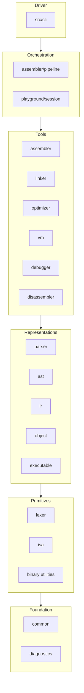
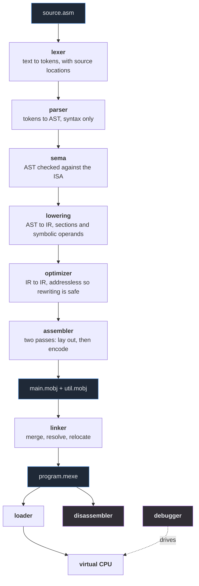
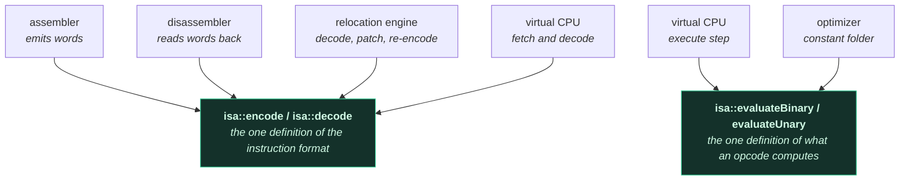

# Architecture

## Layering

Dependencies point strictly downwards. A lower layer never includes a
header from a higher one, and nothing below `cli/` knows that a command
line exists.

Read an arrow as "may include headers from". There is no arrow upwards
anywhere, which is what makes any layer usable without the ones above it:
the tests link the same library the driver does, and the playground reuses
the pipeline rather than reimplementing it.

## The pipeline

Each arrow is a data structure you can inspect from the command line:
`minitool objdump` for an object, `minitool verify` and
`minitool disassemble` for an executable.

## Modules

| Module | Header | Responsibility |
|---|---|---|
| `common` | `common/types.hpp` | Fixed-width integer aliases used everywhere. |
| `common` | `common/byte_order.hpp` | The only sanctioned way to move integers in and out of byte buffers. Little-endian, host-independent, plus range checks. |
| `common` | `common/binary.hpp` | Append-and-patch writer, bounds-checked reader, deduplicating string table — shared by both binary formats. |
| `common` | `common/checksum.hpp` | CRC-32 for format integrity. |
| `common` | `common/source_manager.hpp` | Owns source text; `SourceLocation` stays a 16-byte value. |
| `diagnostics` | `diagnostics/*.hpp` | Severities, stable error codes, caret rendering. No global state; never writes to a stream itself. |
| `isa` | `isa/opcode.hpp` | The frozen opcode table and per-opcode metadata. |
| `isa` | `isa/encoding.hpp` | The single canonical encoder/decoder, shared by assembler, disassembler and VM. |
| `isa` | `isa/semantics.hpp` | What each ALU opcode *means*, shared by the VM and the optimizer. |
| `lexer` | `lexer/lexer.hpp` | Text to tokens. No semantic knowledge. |
| `ast` | `ast/ast.hpp` | The parse tree: what was written, not what it means. |
| `parser` | `parser/parser.hpp` | Recursive descent, three-token lookahead, line-level recovery. |
| `assembler` | `assembler/sema.hpp` | Validates a file against the ISA and the directive rules. |
| `ir` | `ir/ir.hpp` | Addressless IR: the optimizer's world. |
| `ir` | `ir/lower.hpp` | AST to IR. |
| `optimizer` | `optimizer/optimizer.hpp` | Local transformations, with FLAGS liveness over the CFG. |
| `assembler` | `assembler/assembler.hpp` | Two-pass assembly: layout, then encoding and relocations. |
| `object` | `object/*.hpp` | The `.mobj` model, its serialisation, and the relocation engine. |
| `linker` | `linker/linker.hpp` | Merge, resolve, relocate, emit. |
| `executable` | `executable/*.hpp` | The `.mexe` model, its serialisation, and image validation. |
| `vm` | `vm/*.hpp` | Virtual memory, syscalls, the CPU. |
| `disassembler` | `disassembler/disassembler.hpp` | Machine code to assembly, through the VM's decoder. |
| `debugger` | `debugger/debugger.hpp` | Drives the VM through its public interface only. |

## The two shared cores

Two pieces of code are shared *deliberately*, because a second copy would
be free to disagree:

* **`isa::encode` / `isa::decode`.** The assembler, the disassembler, the
  relocation engine and the VM all use them. A disassembler with its own
  decoder is a disassembler that can lie about what will execute
  (architectural rule 9).
* **`isa::evaluateBinary` / `evaluateUnary`.** The VM's execute step and
  the optimizer's constant folder both call them. A folder that computes
  `2 + 2` differently from the machine is the classic way an optimizing
  toolchain goes quietly wrong.

The arrows all point *into* the shared definition. That is the whole
point: there is nowhere for a second opinion to live. It is also why the
playground refuses to compile assembly in JavaScript
([ADR-012](adr/ADR-012-playground-architecture.md)) — that would add a
third box with no arrow into either of these.

## Invariants

1. `decode(encode(i)) == i` for every canonical instruction.
2. `encode(decode(w)) == w` for every word the decoder accepts.
3. No 64-bit input can make the decoder crash or invoke undefined
   behaviour; every rejection is a typed error.
4. Reserved encoding fields are validated, never ignored.
5. Out-of-range values are errors, never truncated — in the encoder, in
   the assembler, and in the relocation engine.
6. `serialize(deserialize(x))` reproduces the original bytes exactly, for
   both formats.
7. The same source produces byte-identical output on every run.
8. `run(program) == run(optimize(program))` for output, exit code and all
   sixteen registers.
9. No malformed binary input can cause an out-of-range read; every
   offset, length and index is validated before use.
10. No program can hang the VM: every run is bounded by an instruction
    budget.
11. No global mutable state anywhere in the libraries.
12. Errors are returned as `std::expected`; nothing in the core throws
    for ordinary invalid input.

Each of these is a test, not an aspiration; `docs/testing.md` says which.

## Error handling policy

* Invalid **input** — bad source, malformed binary, out-of-range value —
  is a value: `std::expected<T, E>` or a `Diagnostic`.
* Broken **internal invariants** are `INTERNAL_ERROR` diagnostics or
  assertions; they indicate a bug in the toolchain, not in the user's
  program.
* Nothing is ever silently ignored, truncated or clamped.

## Architectural rules

The master plan's §65 rules, and where each is enforced:

| Rule | Enforced by |
|---|---|
| 1. The lexer does no semantic analysis | `lexer/` includes only `isa/registers.hpp`, for classification |
| 2. The parser encodes nothing | `parser/` does not include `isa/encoding.hpp` |
| 3. The assembler executes nothing | `assembler/` does not include `vm/` |
| 4. The object reader holds no linker logic | `object_io.cpp` includes no `linker/` header |
| 5. The linker knows no VM internals | `linker/` includes only `executable/` and `object/` |
| 6. The VM knows no source syntax | `vm/` includes no `lexer/`, `parser/` or `ast/` header |
| 7. The debugger drives the VM through its interface | `debugger/` touches only public `VirtualMachine` members |
| 8. The optimizer works on an explicit IR | `optimizer/` takes `ir::Module`, not bytes |
| 9. One canonical decoder | `isa::decode`, used by the VM, the disassembler and relocation |
| 10. Formats are specified independently of their structs | `docs/object-format.md`, `docs/executable-format.md` |
