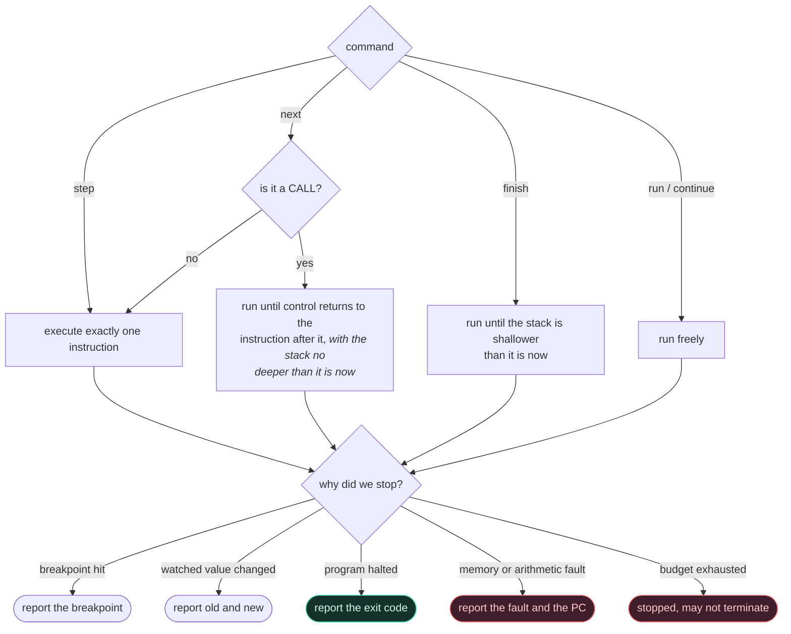

# The debugger

```
minitool debug program.mexe
minitool debug program.mexe -x "break main" -x "run"
```

The debugger drives the VM entirely through its public interface
(architectural rule 7): it single-steps the machine and inspects its
state. It never reaches into the CPU's internals and never patches the
program image — which is why breakpoints here are a set of addresses
checked before each instruction, rather than trap instructions written
into the code. Nothing the debugger does can change what the program
computes.

## 1. Commands

| Command | Short | Effect |
|---|---|---|
| `run`, `continue` | `r`, `c` | run until a breakpoint, a watchpoint, a fault or exit |
| `step` | `s` | execute one instruction |
| `next` | `n` | step, but run a `CALL` to completion |
| `finish` | | run until the current function returns |
| `break <addr\|symbol>` | `b` | set a breakpoint |
| `watch <addr>` | | stop when the 8 bytes there change |
| `delete <id>` | `d` | remove a breakpoint or watchpoint |
| `enable`/`disable <id>` | | without deleting it |
| `info` | | list breakpoints and watchpoints, with hit counts |
| `registers` | `regs` | the register file, hex and signed decimal |
| `print <register>` | `p` | one register |
| `memory <addr> [len]` | `x` | hex dump with ASCII |
| `stack` | | the top of the stack, with symbol annotations |
| `disassemble [addr] [n]` | `dis` | code around the PC, current line marked |
| `backtrace` | `bt` | the call stack |
| `list` | `l` | the current source location |
| `help` | `h` | this table |
| `quit` | `q` | leave |

Addresses may be written as `0x10000`, as decimal, or as a symbol name.

## 2. A session

```
$ minitool debug factorial.mexe
minidbg — type 'help' for commands
examples/factorial.asm:9:5
=> 0000000000010000:  1110000000000000A  MOVI R1, 10

(minidbg) break factorial
breakpoint 1 at 0x0000000000010020

(minidbg) run
stopped at breakpoint, PC = 0x0000000000010020 (factorial)

(minidbg) registers
R0   0x0000000000000000                     0   R1   0x000000000000000A         10
...
PC   0x0000000000010020   SP   0x000000007FFEFFF8
FLAGS 0x0 [----]  instructions: 2

(minidbg) backtrace
#0  0x0000000000010020  factorial
#1  0x0000000000010010  _start+16

(minidbg) finish
PC = 0x0000000000010010

(minidbg) print R1
R1 = 0x0000000000375F00 (3628800)
```

## 3. Breakpoints

A breakpoint stops execution *before* the instruction at its address
runs, so the machine state you inspect is the state that instruction is
about to see.

`continue` from a breakpoint steps past it before checking again, so
resuming makes progress rather than reporting the same stop forever —
a small detail that is very obvious when it is wrong, and is pinned by
`Debugger.ContinuesPastABreakpointItIsParkedOn`.

Breakpoints count their hits, which is what makes them useful in a loop.

## 4. Watchpoints

A watchpoint records the 8 bytes at an address and reports when they
change:

```
(minidbg) watch total
watchpoint 2 on 0x0000000000200000
(minidbg) continue
watchpoint triggered: [2] 0x200000: 0x0 -> 0xF
```

They are checked after each instruction, so a watchpoint stop lands on
the instruction *after* the write. That is a consequence of not having
hardware watchpoint support, and is the honest thing to report.

## 5. Stepping

* `step` executes exactly one instruction.
* `next` steps unless the current instruction is a `CALL`, in which case
  it runs until control returns to the instruction after it *with the
  stack no deeper than it was* — so recursion does not stop it early.
* `finish` runs until the stack is shallower than it is now, which is the
  current frame returning.



The "stack no deeper" condition on `next` is what makes it work through
recursion: a recursive call returns to the same address the outer call
would, so an address check alone would stop at the first inner return.

Both `next` and `finish` still honour breakpoints inside the callee, and
both are bounded by the instruction budget, so neither can hang on a
function that never returns.

## 6. Backtrace

Without frame pointers to walk — `R13` is callee-saved but a leaf
function need not set it up — the backtrace scans the stack for values
that look like return addresses: 8-byte aligned, inside mapped code, and
*immediately preceded by a `CALL`*. That last check is what makes it
reliable in practice, and it is only possible because the disassembler
and the VM share one decoder.

This is a heuristic, and it is worth knowing that it is one. A saved
register that happens to hold such a value would appear as a frame.

## 7. Source-level debugging

The executable carries a line table mapping each instruction address to a
file, line and column
([executable-format.md](executable-format.md) §5). `list` and the
prompt's header use it:

```
(minidbg) list
examples/factorial.asm:24:5
```

Build with `-gno` and that information is gone; everything else still
works, on addresses instead of lines.

## 8. Scripting

`-x` runs a command before the interactive loop starts, and may be
repeated:

```
minitool debug program.mexe -x "break _start" -x "run" -x "registers" -x "quit"
```

`Debugger.RunsCommands` uses exactly this path, so the scripted interface
is tested rather than incidental.
