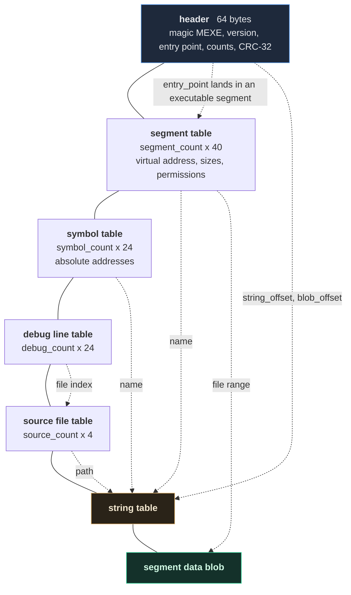

# The `.mexe` executable format

> Version 1. Frozen: golden fixtures in `tests/fixtures/` pin the exact
> bytes.

A `.mexe` file is a memory image plus the metadata a debugger needs. It
holds no sections, no symbol bindings and no relocations — every address
in it is final. That is deliberate: the VM loads executables and nothing
else, and it should not have to understand the assembler's world
(architectural rule 5).

The container follows the same shape as `.mobj`; see
[ADR-009](adr/ADR-009-container-layout.md) and
[object-format.md](object-format.md) §1 for the shared conventions.

## 1. Layout

```
offset  contents
------  --------------------------------------------------------------
0       header                             64 bytes
64      segment table                      segment_count × 40
...     symbol table                       symbol_count  × 24
...     debug line table                   debug_count   × 24
...     source file table                  source_count  × 4
...     string table                       string_size bytes
...     segment data blob                  to the end of the file
```

An executable is the same container shape as an object, minus everything
that only matters before linking: there are no relocations and no section
indices, because every address has already been decided.



## 2. Header (64 bytes)

| Offset | Size | Field |
|---|---|---|
| 0 | 4 | magic — the bytes `M` `E` `X` `E` |
| 4 | 2 | format version (currently 1) |
| 6 | 2 | header size (currently 64) |
| 8 | 8 | entry point — a virtual address |
| 16 | 4 | segment count |
| 20 | 4 | symbol count |
| 24 | 4 | debug entry count |
| 28 | 4 | source file count |
| 32 | 8 | string table offset |
| 40 | 8 | string table size |
| 48 | 8 | segment data offset |
| 56 | 4 | total file size |
| 60 | 4 | CRC-32 of everything after the header |

## 3. Segment record (40 bytes)

| Offset | Size | Field |
|---|---|---|
| 0 | 4 | name — offset into the string table |
| 4 | 1 | type: 0 text, 1 rodata, 2 data, 3 bss |
| 5 | 1 | flags: 1 read, 2 write, 4 execute |
| 6 | 2 | padding |
| 8 | 8 | virtual address |
| 16 | 8 | virtual size |
| 24 | 8 | data offset, relative to the segment data blob |
| 32 | 8 | data size in the file |

A segment whose virtual size exceeds its data size is zero-filled to
length by the loader. `.bss` is the only one that does this today.

## 4. Symbol record (24 bytes)

| Offset | Size | Field |
|---|---|---|
| 0 | 4 | name — offset into the string table |
| 4 | 1 | kind: 0 none, 1 function, 2 object |
| 5 | 3 | padding |
| 8 | 8 | address |
| 16 | 8 | size |

Symbols here are purely informational: the disassembler labels code with
them and the debugger resolves `break helper` through them. The VM never
looks at the table. Entries are sorted by address, then by name, so the
file is deterministic and a lookup can stop early.

## 5. Debug line record (24 bytes)

| Offset | Size | Field |
|---|---|---|
| 0 | 8 | address |
| 8 | 4 | source file index |
| 12 | 4 | line |
| 16 | 4 | column |
| 20 | 4 | padding |

Sorted by address. The linker maps each object's `(section, offset)`
entry to a final address and merges the file tables, so an executable
built from several sources carries all of their line information.

## 6. Validation

The reader performs the structural checks from
[object-format.md](object-format.md) §10, and then validates the *image*
before returning it:

* every segment occupies memory, and its virtual size is at least its
  data size;
* no segment wraps the end of the address space;
* no two segments overlap;
* a `.bss` segment carries no data;
* no segment is both writable and executable;
* the entry point is 8-byte aligned and lands inside a segment that is
  executable;
* every debug entry names a source file that exists.

This is why `minitool verify` is a thin shell over the reader: a
successful read *is* a successful verification, and the loader can then
map the image without re-checking it.

The writer runs the same validation and refuses to produce a file that
would fail it, so an invalid image is a link error rather than a runtime
surprise.

## 7. Loading

`VirtualMachine::load` maps each segment at its virtual address with its
recorded permissions, then adds a stack and a heap
([ADR-011](adr/ADR-011-runtime-abi.md)), sets `PC` to the entry point and
`SP` to the top of the stack. Registers and `FLAGS` start at zero.

Nothing else happens: there is no dynamic linking, no relocation at load
time, and no program headers to interpret. That is the point of doing the
work in the linker.

## 8. Inspecting one

```
minitool verify program.mexe         # header, segments, symbols, lines
minitool disassemble program.mexe    # the code, with symbol labels
minitool debug program.mexe          # step through it
```
