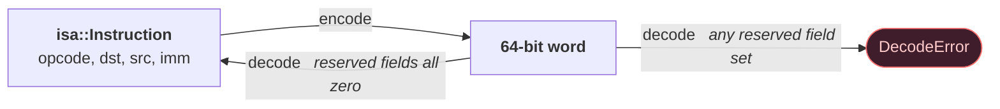
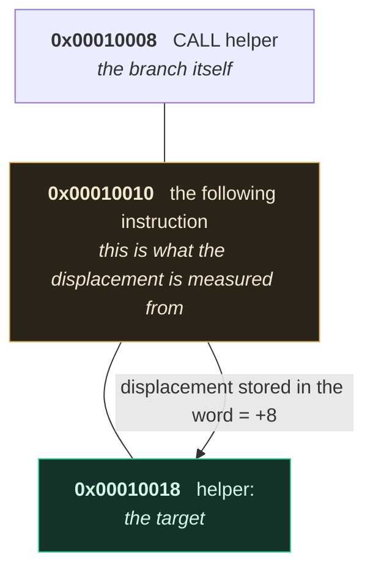

# MiniToolchain ISA — Frozen Specification v1

> Status: **FROZEN** as of v0.2.0. Changes require an ADR.

## 1. Machine model

| Property | Value |
|---|---|
| Register width | 64 bits |
| Address width | 64 bits |
| General-purpose registers | 16 (`R0`–`R15`) |
| Instruction width | 64 bits, fixed |
| Instruction alignment | 8 bytes |
| Byte order | Little-endian, in files and in memory |
| Memory model | Flat, byte-addressable, no paging |

Special registers, not addressable as `Rn`:

| Register | Meaning |
|---|---|
| `PC` | Program counter. Always 8-byte aligned. |
| `SP` | Stack pointer. Grows **downwards**. |
| `FLAGS` | Status flags, see §5. |

`R0` is an ordinary read/write register, **not** a hardwired zero
(see ADR-002).

## 2. Register conventions (calling convention)

| Register | Role | Preserved across a call? |
|---|---|---|
| `R0` | Scratch | No (caller-saved) |
| `R1`–`R4` | Argument registers, in order | No (caller-saved) |
| `R5`–`R12` | Caller-saved temporaries | No |
| `R13` (`FP`) | Frame pointer | Yes (callee-saved) |
| `R14` (`RV`) | Return value | No |
| `R15` | Reserved for the toolchain | Yes — do not use |

`FP` and `RV` are accepted as aliases by the assembler; the disassembler
always prints the canonical `R13` / `R14`.

`CALL` pushes the return address (the address of the instruction after
the `CALL`) onto the stack and jumps. `RET` pops it into `PC`.

## 3. Instruction encoding

```
 63        56 55    52 51    48 47                                        0
+------------+--------+--------+--------------------------------------------+
|   opcode   |  dst   |  src   |          immediate / displacement           |
|   8 bits   | 4 bits | 4 bits |                  48 bits                    |
+------------+--------+--------+--------------------------------------------+
```

The 48-bit immediate field is **sign-extended** to 64 bits for every format
except `SysImm`, where it is zero-extended.

### Formats

| Format | Fields used | Reserved fields (must be zero) | Instructions |
|---|---|---|---|
| `None` | — | dst, src, imm | `NOP` `HALT` `RET` |
| `Reg1` | dst | src, imm | `INC` `DEC` `NEG` `NOT` `PUSH` `POP` |
| `Reg2` | dst, src | imm | `MOV` `ADD` `SUB` `MUL` `DIV` `MOD` `AND` `OR` `XOR` `SHL` `SHR` `SAR` `CMP` `TEST` |
| `RegImm` | dst, imm (signed) | src | `MOVI` `LEA` |
| `Mem` | dst, src, imm (signed) | — | `LOAD` `STORE` |
| `Jump` | imm (signed, PC-relative) | dst, src | `JMP` `JE` `JNE` `JG` `JL` `JGE` `JLE` `CALL` |
| `SysImm` | imm (unsigned) | dst, src | `SYSCALL` |

**Reserved fields are validated, not ignored.** A word whose reserved
fields are non-zero is rejected by the decoder. This makes the codec a
bijection: every instruction has exactly one encoding, and every accepted
word re-encodes to itself. Both directions are property-tested.



Both round trips hold: `decode(encode(i)) == i` for every instruction,
and `encode(decode(w)) == w` for every word that decodes at all. Had the
decoder ignored reserved bits instead, the second would be false — many
words would decode to the same instruction, and a corrupted file could
execute as though it were intact.

Immediate range: `[-2^47, 2^47 - 1]` signed, `[0, 2^48 - 1]` unsigned.
A value outside the range is a `RELOCATION_OVERFLOW` or
`INTEGER_OVERFLOW` error — it is never truncated.

### Branch displacement base

```
target = address_of_branch + 8 + displacement
```

The displacement is relative to the address of the instruction **after**
the branch.



Getting this wrong is invisible for a branch to the very next instruction
and wrong by exactly 8 everywhere else, which is why it is defined once. A branch to itself has displacement `-8`. This is defined once,
in `isa::branchTarget` / `isa::branchDisplacement`, and all of the
assembler, linker, disassembler and VM must use those functions.

## 4. Instruction set (36 instructions)

| Opcode | Mnemonic | Format | Semantics |
|---|---|---|---|
| `0x00` | `NOP` | None | No effect. |
| `0x01` | `HALT` | None | Stops the machine. |
| `0x02` | `SYSCALL n` | SysImm | Invokes host service `n` (see docs/vm.md). |
| `0x10` | `MOV dst, src` | Reg2 | `dst = src` |
| `0x11` | `MOVI dst, imm` | RegImm | `dst = sext(imm)` |
| `0x12` | `LOAD dst, [src + disp]` | Mem | `dst = mem64[src + disp]` |
| `0x13` | `STORE [dst + disp], src` | Mem | `mem64[dst + disp] = src` |
| `0x14` | `LEA dst, imm` | RegImm | `dst = imm` (relocated address) |
| `0x15` | `PUSH src` | Reg1 | `SP -= 8; mem64[SP] = src` |
| `0x16` | `POP dst` | Reg1 | `dst = mem64[SP]; SP += 8` |
| `0x20` | `ADD dst, src` | Reg2 | `dst += src`, sets flags |
| `0x21` | `SUB dst, src` | Reg2 | `dst -= src`, sets flags |
| `0x22` | `MUL dst, src` | Reg2 | `dst *= src`, sets flags |
| `0x23` | `DIV dst, src` | Reg2 | signed quotient; `src == 0` traps |
| `0x24` | `MOD dst, src` | Reg2 | signed remainder; `src == 0` traps |
| `0x25` | `INC dst` | Reg1 | `dst += 1`, sets flags |
| `0x26` | `DEC dst` | Reg1 | `dst -= 1`, sets flags |
| `0x27` | `NEG dst` | Reg1 | `dst = -dst`, sets flags |
| `0x30` | `AND dst, src` | Reg2 | bitwise and, sets flags |
| `0x31` | `OR dst, src` | Reg2 | bitwise or, sets flags |
| `0x32` | `XOR dst, src` | Reg2 | bitwise xor, sets flags |
| `0x33` | `NOT dst` | Reg1 | bitwise complement, flags unchanged |
| `0x34` | `SHL dst, src` | Reg2 | logical left, shift count is `src & 63` |
| `0x35` | `SHR dst, src` | Reg2 | logical right, count `src & 63` |
| `0x36` | `SAR dst, src` | Reg2 | arithmetic right, count `src & 63` |
| `0x40` | `CMP dst, src` | Reg2 | flags of `dst - src`; registers unchanged |
| `0x41` | `TEST dst, src` | Reg2 | flags of `dst & src`; registers unchanged |
| `0x50` | `JMP rel` | Jump | unconditional |
| `0x51` | `JE rel` | Jump | `ZF == 1` |
| `0x52` | `JNE rel` | Jump | `ZF == 0` |
| `0x53` | `JG rel` | Jump | `ZF == 0 && SF == OF` |
| `0x54` | `JL rel` | Jump | `SF != OF` |
| `0x55` | `JGE rel` | Jump | `SF == OF` |
| `0x56` | `JLE rel` | Jump | `ZF == 1 \|\| SF != OF` |
| `0x57` | `CALL rel` | Jump | push return address, then jump |
| `0x58` | `RET` | None | pop `PC` |

Opcode numbers are part of the on-disk format. **Never renumber.** New
instructions take a free slot in their range and require: opcode
assignment, encoding, decoder, executor, assembler, disassembler, tests,
and a docs update.

## 5. FLAGS

| Bit | Name | Set when |
|---|---|---|
| 0 | `ZF` | result == 0 |
| 1 | `SF` | result is negative (bit 63 set) |
| 2 | `CF` | unsigned carry / borrow out |
| 3 | `OF` | signed overflow |

All other bits are reserved and read as zero. Conditional branches use
signed comparisons (`SF`/`OF`), so `CMP` followed by `JL` is a signed
`<`.

## 6. Deliberate omissions

There is **no immediate form of arithmetic** (`ADD R1, 20` does not
exist); arithmetic is register-register only, and constants are
materialised with `MOVI`. See ADR-006 for why, and for the discrepancy
in the master plan that prompted the decision.

There is no `MOVI` form capable of loading a full 64-bit constant in one
instruction, because the immediate field is 48 bits. Constants outside
`[-2^47, 2^47)` must be built with `MOVI` + `SHL` + `OR`.
