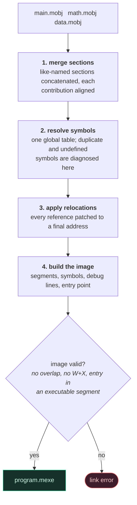
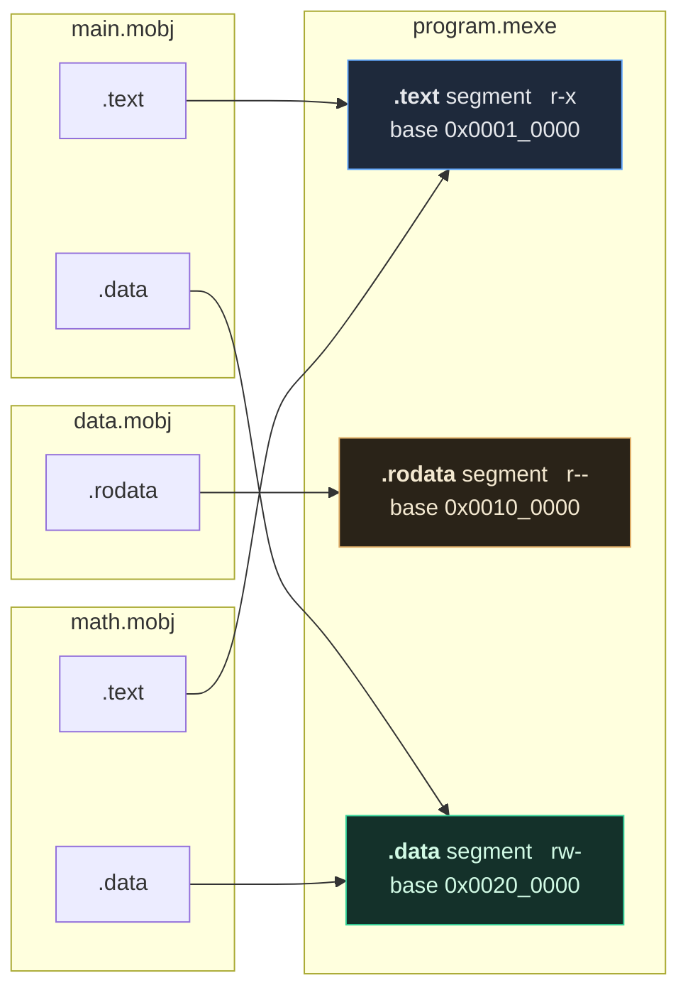

# The linker

The linker turns one or more `.mobj` files into a `.mexe` image. It is
the only component that sees the whole program, and therefore the only
one that can answer "where does this actually live?".

```
minitool link main.mobj math.mobj data.mobj -o program.mexe
```

## 1. Stages



Each stage completes for every object before the next begins. That
ordering is what makes forward references across files work: stage 3 can
resolve a call into an object that had not been placed when the calling
object was read.

Stages 1 and 2 together are what turns several independent files into one
address space:



Objects are merged in the order they were given, and each contribution
starts on an 8-byte boundary — so two objects each contributing two bytes
of `.data` produce a ten-byte segment, not a four-byte one. That padding
is deliberate and asserted by
`MultiFile.SectionsFromEveryObjectAreConcatenated`; a reader who assumes
contributions are packed will compute the wrong address for the second
one.

## 2. Stage 1 — merging sections

Each input section is appended to the output region for its type, after
padding to the section's own alignment:

```
region .text:
  [ main.mobj .text ][ pad ][ math.mobj .text ][ pad ][ ... ]
```

The offset each input landed at is recorded, and everything later —
symbol addresses, relocation sites, debug entries — is computed from it.
Sections are placed in input order, so the same command line always
produces the same image.

Region bases and the 960 KiB size cap are in
[ADR-011](adr/ADR-011-runtime-abi.md). A section that outgrows its region
is a link error naming the region, not a silent overlap with the next
one.

## 3. Stage 2 — resolving symbols

Every defined symbol gets a final address:

```
address = region base + the object's offset in that region + symbol value
```

Local symbols stay private to their object; two files may both define
`.Lloop`. Global and weak symbols go into one table, where the conflict
rules are:

| Situation | Result |
|---|---|
| One definition | it wins |
| Two strong (`.global`) definitions | error: defined in more than one object |
| Strong and weak | the strong one wins |
| Two weak definitions | the first in input order wins |
| A reference with no definition | error: undefined symbol, naming the file |
| A *weak* reference with no definition | resolves to address 0 |

The last row is the useful half of weak linkage: a program can test
whether an optional routine was linked in.

## 4. Stage 3 — applying relocations

Described in [relocation.md](relocation.md). Every reference is patched;
anything out of range stops the link.

## 5. Stage 4 — building the image

* One segment per non-empty region, carrying the permissions of its type.
  `.bss` gets a size and no data.
* The symbol table gets every global definition, plus local symbols when
  `keep_local_symbols` is set (the default — the debugger is much more
  useful with them). Entries are sorted by address.
* Debug entries are translated from `(section, offset)` to a final
  address, source-file indices are renumbered into a merged table, and
  the result is sorted by address.
* The entry point is looked up by name — `_start` unless `--entry` says
  otherwise — and its absence is an error.
* The finished image is validated
  ([executable-format.md](executable-format.md) §6) before it is
  returned, so the linker cannot emit something the loader would refuse.

## 6. Determinism

Given the same objects in the same order, the linker produces
byte-identical output. Symbols are held in an ordered map and emitted
sorted; nothing depends on hash iteration order or on addresses from the
linker's own heap.

Input *order* is part of the input: `link a.mobj b.mobj` and
`link b.mobj a.mobj` both produce valid programs that behave the same,
but the two images differ in where each object's code sits.
`Linker.LinkOrderDoesNotChangeTheAnswer` checks the behaviour; the byte
layout is deliberately not promised across orderings.

## 7. What the linker does not do

* **It does not know how the VM works.** It produces an image and
  validates it; how that image is executed is the VM's business
  (architectural rule 5).
* **It does not optimize.** Dead code elimination happens in the IR,
  before addresses exist. A linker-level equivalent would need to know
  which sections are reachable, and nothing here records that yet.
* **It does not do dynamic linking, shared libraries or lazy binding.**
  Out of scope (master plan §4.3).

## 8. Errors

| Error | Cause |
|---|---|
| `undefined symbol 'x' referenced by f.asm` | nothing defines it |
| `symbol 'x' is defined in more than one object` | two strong definitions |
| `entry point '_start' is not defined in any object` | no entry |
| `.text grows past its 960 KiB region` | a section too large to place |
| `RELOCATION_OVERFLOW` | a reference too far to encode |
| `no object files to link` | an empty command line |

Every one of them is covered in `tests/failure/test_failure_cases.cpp`.
