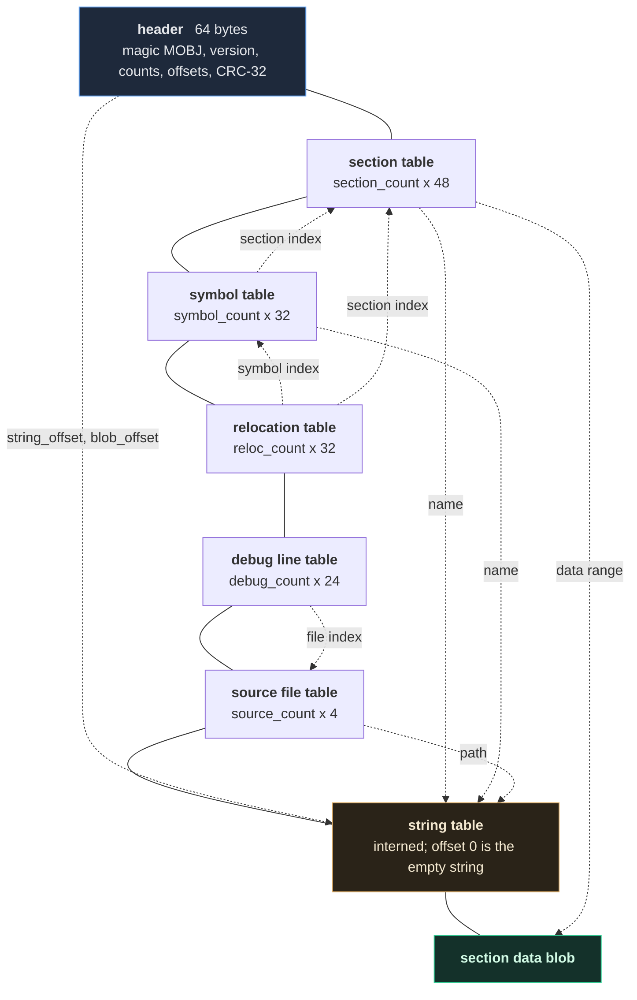

# The `.mobj` object file format

> Version 1. Frozen: golden fixtures in `tests/fixtures/` pin the exact
> bytes, so a change here has to be deliberate enough to regenerate them.

A `.mobj` file is the output of assembling one source file: machine code
that is not yet at any particular address, plus everything the linker
needs to place it. See [ADR-009](adr/ADR-009-container-layout.md) for why
the container is shaped this way.

This document specifies the bytes. The C++ structs in
`include/minitool/object/object.hpp` are one program's way of holding
them in memory, not the definition (architectural rule 10).

## 1. Conventions

* All integers are little-endian, whatever the host is.
* All offsets are byte offsets from the start of the file, unless stated
  otherwise.
* Padding bytes are zero, and readers **reject** a non-zero value rather
  than skipping it.

## 2. Layout

```
offset  contents
------  --------------------------------------------------------------
0       header                             64 bytes
64      section table                      section_count × 48
...     symbol table                       symbol_count  × 32
...     relocation table                   reloc_count   × 32
...     debug line table                   debug_count   × 24
...     source file table                  source_count  × 4
...     string table                       string_size bytes
...     section data blob                  to the end of the file
```

Each table begins immediately after the previous one. The header records
where the string table and the blob start, and a reader checks those
against its own computation before reading anything.

The offsets above are only half the structure. The other half is the
cross-references between the tables — every one of which is an index a
malformed file could point anywhere, and every one of which is validated
before use:



Solid lines are file order; dotted lines are references. The CRC-32 in
the header covers everything after the header, so any byte a reader
trusts has already been checked once at the whole-file level and again
individually. See §10.

## 3. Header (64 bytes)

| Offset | Size | Field |
|---|---|---|
| 0 | 4 | magic — the bytes `M` `O` `B` `J` |
| 4 | 2 | format version (currently 1) |
| 6 | 2 | header size (currently 64) |
| 8 | 4 | flags — reserved, must be 0 |
| 12 | 4 | section count |
| 16 | 4 | symbol count |
| 20 | 4 | relocation count |
| 24 | 4 | debug entry count |
| 28 | 4 | source file count |
| 32 | 8 | string table offset |
| 40 | 8 | string table size |
| 48 | 8 | section data offset |
| 56 | 4 | total file size |
| 60 | 4 | CRC-32 of everything after the header |

## 4. Section record (48 bytes)

| Offset | Size | Field |
|---|---|---|
| 0 | 4 | name — offset into the string table |
| 4 | 1 | type: 0 null, 1 text, 2 rodata, 3 data, 4 bss |
| 5 | 1 | flags: 1 alloc, 2 write, 4 exec |
| 6 | 2 | padding |
| 8 | 8 | alignment — a power of two |
| 16 | 8 | data offset, relative to the section data blob |
| 24 | 8 | data size in the file |
| 32 | 8 | memory size |
| 40 | 4 | section index |
| 44 | 4 | padding |

`.bss` has a memory size and no data, so its data size is zero. For every
other section the two are equal.

## 5. Symbol record (32 bytes)

| Offset | Size | Field |
|---|---|---|
| 0 | 4 | name — offset into the string table |
| 4 | 1 | binding: 0 local, 1 global, 2 weak, 3 extern |
| 5 | 1 | type: 0 none, 1 object, 2 function, 3 section |
| 6 | 1 | defined (0 or 1) |
| 7 | 1 | padding |
| 8 | 4 | section index, or `0xFFFFFFFF` if undefined |
| 12 | 4 | padding |
| 16 | 8 | value — the offset within its section |
| 24 | 8 | size in bytes, 0 if unknown |

Symbol *indices* are positional: relocations refer to symbols by their
position in this table. A reader therefore rejects a file with two
symbols of the same name, since that would silently renumber every
relocation after it.

## 6. Relocation record (32 bytes)

| Offset | Size | Field |
|---|---|---|
| 0 | 4 | section index to patch |
| 4 | 4 | symbol index |
| 8 | 8 | offset within the section |
| 16 | 8 | addend (signed) |
| 24 | 1 | type — see [relocation.md](relocation.md) |
| 25 | 7 | padding |

The reader checks that the patched field fits inside the named section
before accepting the record, so a relocation can never point outside its
own data.

## 7. Debug line record (24 bytes)

| Offset | Size | Field |
|---|---|---|
| 0 | 4 | section index |
| 4 | 4 | source file index |
| 8 | 8 | offset within the section |
| 16 | 4 | line (1-based) |
| 20 | 4 | column (1-based) |

One entry per instruction. `-gno` omits the table entirely, which changes
nothing except the file size and what the debugger can tell you.

## 8. Source file table

`source_count` 4-byte string-table offsets, one per file that
contributed debug entries.

## 9. String table

A blob of NUL-terminated strings. Offset 0 is always the empty string, so
a zero name reference is unambiguously "no name". Strings are interned,
so a name used twice is stored once.

## 10. Validation

`readObjectFromBuffer` performs all of this before returning, in order:

1. The file is at least 64 bytes.
2. Magic, version and header size match.
3. The recorded file size equals the actual size.
4. The CRC-32 matches.
5. Every table's extent, computed from the counts, lies inside the file,
   and the string table and blob start exactly where the header says.
6. Every enum value is defined; every reserved field is zero.
7. Every alignment is a power of two.
8. Every string offset is inside the string table and terminated.
9. Every section's data range lies inside the blob, and its memory size
   is at least its data size.
10. Every symbol, relocation and debug entry indexes a section, symbol
    and file that exist.
11. Every relocation's patched field fits inside its section.

A failure returns a message naming the field. No malformed input can
cause an out-of-range read: `tests/unit/test_object.cpp` flips every
single byte of a valid file in turn and requires that none of them
produces a crash, and `tests/fuzz/test_fuzz.cpp` runs random and mutated
buffers through the same reader.

## 11. Determinism

The same source assembled twice produces byte-identical files. Nothing in
the writer depends on hash iteration order, heap addresses, timestamps,
or the absolute path of the source. `FormatProperties.AssemblyIsReproducible`
checks this over generated programs, and the golden fixtures check it
across builds.

## 12. Reading one

```
minitool objdump program.mobj
```

prints the sections, symbols, relocations and a disassembly of `.text` at
section offsets — addresses do not exist yet at this stage.
