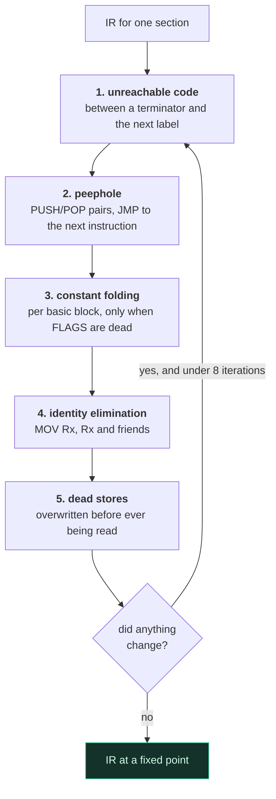
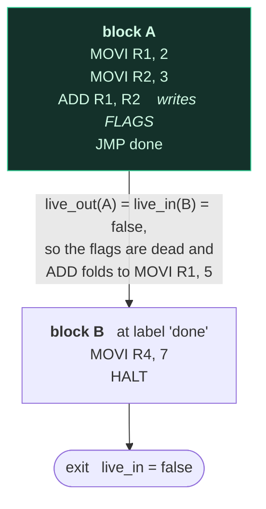
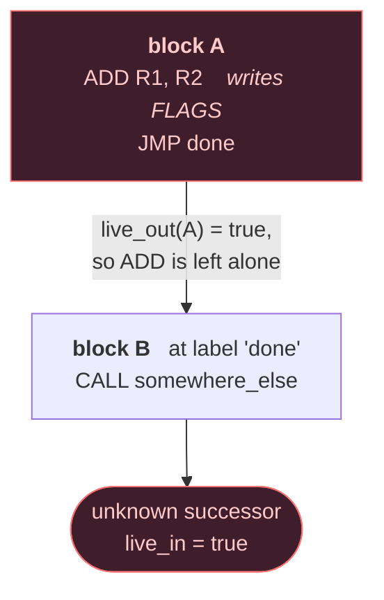

# The optimizer

The optimizer rewrites the IR between lowering and assembly:

```
AST -> IR -> [optimizer] -> IR -> assembler -> .mobj
```

Why it works on an addressless IR rather than on encoded instructions —
and why that is the difference between an optimizer that can be correct
and one that cannot — is in
[ADR-008](adr/ADR-008-optimizer-ir.md).

```
minitool build program.asm -o program.mexe -O1 --stats
```

## 1. Levels

| Level | Behaviour |
|---|---|
| `-O0` | Emit exactly what was written. The default. |
| `-O1` | Local transformations within a basic block. |

## 2. The two rules every pass obeys

1. **A label is never moved, merged or deleted.** Labels are the only
   entry points to a basic block, so every branch target that existed
   before a pass still exists after it. Unreachable *code* is deleted;
   the label in front of it is not.
2. **FLAGS is an output like any other.** An instruction that sets flags
   is only rewritten into one that does not when the flags are provably
   dead — established by the liveness analysis in §4, not by inspection.

## 3. The passes

They run in this order, and the whole set repeats until nothing changes.
Passes feed each other — folding creates dead stores, deleting a jump
exposes unreachable code — so a single sweep would leave work on the
table:



The iteration bound is a safety net rather than a real limit: every pass
only deletes or simplifies, so the sequence converges on its own.

### Constant folding

Tracks known register values within a basic block and evaluates
operations whose inputs are all known.

```asm
MOVI R1, 40
MOVI R2, 2
ADD  R1, R2        ->  MOVI R1, 42
```

Preconditions: no operand is symbolic (an address is not known until link
time), the operation does not trap (a division by zero is left in place
so the VM traps exactly where the program asked), the result fits the
48-bit immediate field, and the flags are dead.

### Identity elimination

`MOV rX, rX` and `NOP` are removed. Neither writes a register or a flag.

Arithmetic identities such as `ADD rX, rY` where `rY` is known to be zero
are left to constant folding, which already knows whether the flags
matter.

### Dead store elimination

A write whose value is overwritten later in the same block, with no read
in between, is removed.

```asm
MOVI R1, 1
MOVI R1, 2         ->  MOVI R1, 2
```

Only pure defining moves (`MOV`, `MOVI`, `LEA`) qualify: an instruction
that also sets flags, touches memory or reads its own destination has
effects beyond the register. Nothing is assumed about liveness across the
block boundary, so this needs no global analysis to be safe.

### Unreachable code elimination

Instructions between an unconditional terminator (`JMP`, `RET`, `HALT`)
and the next label can never execute.

```asm
    HALT
    MOVI R1, 1      ->  (removed)
    MOVI R2, 2      ->  (removed)
reachable:          ->  (kept — something may branch here)
    NOP
```

### Peephole

* `PUSH rX` / `POP rX` — both removed; the register and `SP` both end up
  where they started.
* `PUSH rX` / `POP rY` — replaced by `MOV rY, rX`.
* `JMP label` where `label` is the next thing in the section — removed.

The `PUSH`/`POP` rewrites assume that memory below `SP` is not
observable, which is true of this machine: nothing reads below the stack
pointer, and no other thread exists.

Passes run to a fixed point (at most eight iterations), because each one
exposes work for the others: folding creates dead stores, and deleting a
jump exposes unreachable code.

## 4. FLAGS liveness

Nearly every ALU instruction writes flags, so "are the flags dead here?"
decides whether folding can fire at all. The first implementation
answered it within a single block, which was sound and nearly useless: a
block usually ends before it overwrites its own flags.

The optimizer now builds the section's control-flow graph — blocks split
at labels and after branches, `HALT`, `RET` and `SYSCALL` — and solves
backward liveness:

```
live_out(B) = unknown_successor(B) OR any live_in(S) for successors S
live_in(B)  = B reads FLAGS before writing it
              OR (live_out(B) AND B never writes FLAGS)
```

iterated to a fixed point so loops converge. A successor that cannot be
determined — a `CALL`, a literal displacement, a branch to a label from
another file — sets `unknown_successor` and forces the conservative
answer.

This is why the analysis has to cross block boundaries. In the program on
the left, the `ADD` sets flags that nothing ever reads — but the block it
lives in ends before overwriting them, so a within-block analysis has to
assume they are live and the fold never fires:



Change `HALT` to something whose successor is unknown and the answer
flips, conservatively:



`Optimizer.FoldsWhenTheFlagsAreDeadAcrossBlocks` and
`Optimizer.DoesNotFoldWhenTheFlagsAreLive` are the two halves of this.

## 5. Why the folder cannot disagree with the machine

A constant folder that computes `2 + 2` differently from the CPU that
runs the unfolded code is a classic way for an optimizing toolchain to go
quietly wrong.

Here there is one implementation. `isa::evaluateBinary` and
`evaluateUnary` in `include/minitool/isa/semantics.hpp` define what every
ALU opcode does, including the flags, and *both* the VM's execute step
and the optimizer's folder call them. There is no second copy to drift.

## 6. How it is held honest

Every pass has a semantic-equivalence test, and the suite as a whole runs
the same program at both levels and compares everything observable —
output, exit code, all sixteen registers, and the stack pointer:

* `OptimizerEquivalence.*` — hand-written programs covering arithmetic,
  loops, calls, memory, output and flag-dependent branches.
* `OptimizerProperties.OptimizationPreservesObservableBehaviour` — 120
  randomly generated programs, seeded so a failure is reproducible.
* `OptimizerProperties.OptimizationNeverAddsInstructions`.
* `OptimizerProperties.OptimizationIsIdempotent` — optimizing the output
  again changes nothing, which is what a fixed point means.
* `Pipeline.EveryCheckedInExampleAssemblesLinksAndRuns` runs all eight
  examples at both levels and compares.

The optimizer is measured by instructions executed. It is *judged* by
those equivalence tests. It may never change behaviour to improve a
number.

## 7. Measured effect

`examples/optimization.asm`, which is written to be reducible:

```
$ minitool build examples/optimization.asm -o o0.mexe -O0 --stats
examples/optimization.asm: O0 15 -> 15 instructions (0 folded, ...)

$ minitool build examples/optimization.asm -o o1.mexe -O1 --stats
examples/optimization.asm: O1 15 -> 5 instructions
    (1 folded, 2 identities, 2 dead stores, 3 unreachable, 3 peepholes)

$ minitool run o0.mexe --stats     # 12 instructions executed
$ minitool run o1.mexe --stats     #  5 instructions executed
```

On the benchmark program, which is not written to be reducible, the
reduction is 12.5% of executed instructions. Both numbers are worth
knowing: the first says the passes work, the second says what they are
worth on code that was not written for them.

## 8. What it does not do

No inlining, no cross-block motion, no register allocation, no strength
reduction, no loop transformations. All of those need information the IR
does not carry — a call graph, or liveness across sections — and each
would need its own ADR and its own equivalence tests.
