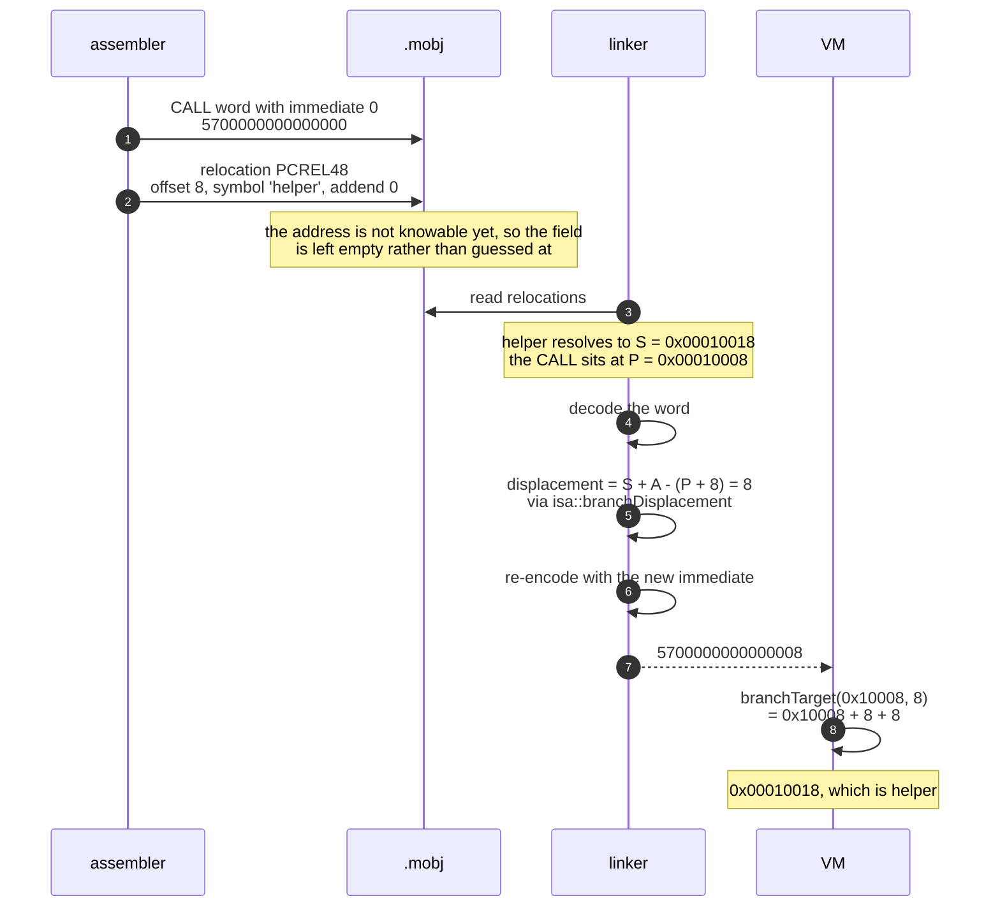

# Relocation

A relocation is a note the assembler leaves for the linker: *"the value
at this offset is the address of that symbol, and I do not know it yet."*
Everything about which addresses are unknown at assembly time, and how
they get filled in, is here.

The choice of types is argued in
[ADR-007](adr/ADR-007-relocation-model.md).

## 1. The five types

Writing `S` for the symbol's final address, `A` for the addend and `P`
for the address of the patched field:

| Value | Name | Width | Stored value | Range check |
|---|---|---|---|---|
| 0 | `ABS32` | 4 bytes | `S + A` | unsigned 32 bits |
| 1 | `ABS64` | 8 bytes | `S + A` | none needed |
| 2 | `PCREL32` | 4 bytes | `S + A - P` | signed 32 bits |
| 3 | `IMM48` | instruction field | `S + A` | signed 48 bits |
| 4 | `PCREL48` | instruction field | `S + A - (P + 8)` | signed 48 bits |

The two instruction-field types patch the 48-bit immediate inside a
64-bit instruction word rather than a run of bytes. They decode the word,
replace the immediate and re-encode it, so the range check is the
encoder's own and the field layout stays known to one module.

`PCREL48` is *defined* as `isa::branchDisplacement(P, S + A)` and the
implementation calls that function. The branch rule — a displacement is
relative to the instruction *after* the branch — lives in the ISA layer,
and the linker borrows it rather than restating it.

## 2. Which one the assembler emits

| Source | Relocation |
|---|---|
| `JMP label`, `Jcc label`, `CALL label` | `PCREL48` |
| `MOVI R1, symbol`, `LEA R1, symbol` | `IMM48` |
| `.qword symbol` | `ABS64` |
| `.dword symbol` | `ABS32` |

`PCREL32` is not emitted by the assembler today. It is specified and
implemented because the format needs a PC-relative *data* relocation the
moment anything wants a self-relative pointer table, and defining it now
costs one switch arm.

## 3. What the assembler leaves behind

For a symbolic operand the assembler encodes the instruction with a zero
immediate and records:

```
section   the section being patched
offset    the byte offset of the field within that section
type      one of the five above
symbol    an index into this object's symbol table
addend    the constant from `symbol + 8`, or 0
```

The zero placeholder is not a marker — nothing looks for it — it just
keeps the instruction encodable and the file deterministic.

```
$ minitool objdump math.mobj
relocations:
  PCREL48  section 0 + 0x18     -> .Ldone +0
  PCREL48  section 0 + 0x30     -> .Lloop +0
```

## 4. What the linker does

For each relocation, in order:

1. **Find the symbol.** A defined local symbol resolves within its own
   object; anything else goes through the global symbol table.
2. **Compute the final address.** `region base + the object's offset
   within the merged region + the symbol's offset within its section`.
3. **Shift the relocation.** Its offset is relative to its own section,
   which is now somewhere inside a merged region.
4. **Apply the formula** for the type.
5. **Check the range.** Out of range is `RELOCATION_OVERFLOW`, reported
   with the type, the symbol, the region and the offset.
6. **Patch the bytes** — only after every check has passed.

Step 6 coming last matters: a failed relocation leaves the buffer exactly
as it was, so a link that fails halfway cannot emit a half-patched image.

## 5. Invariants

1. **Nothing is ever truncated.** A value that does not fit its field is
   an error. `Relocation.Abs32RejectsValuesThatDoNotFit` also checks that
   the field is unmodified afterwards.
2. **An instruction-field relocation must name an instruction.** The
   offset must be 8-byte aligned and the word must decode; otherwise the
   relocation is rejected rather than corrupting whatever was there.
3. **A relocation cannot point outside its section.** The object reader
   checks this when the file is loaded, before the linker sees it.
4. **`PCREL48` agrees with the VM.** `branchTarget(P, applied) == S + A`
   — asserted directly in `Relocation.PcRel48MatchesTheIsaBranchRule`,
   because an off-by-one instruction here is the classic linker bug.
5. **`.bss` holds no relocations.** It has no bytes to patch, and the
   linker says so rather than writing into a phantom buffer.

## 6. A worked example

```asm
_start:
    CALL helper     ; at 0x00010008 after linking
    HALT
helper:             ; at 0x00010018
    RET
```

The assembler emits `CALL` with a zero immediate and a `PCREL48`
relocation at offset 8 naming `helper`.



The linker and the VM both call into `isa`, which is the only reason the
two arrows at the bottom agree. Neither does the arithmetic itself.

At link time `S = 0x00010018`, `A = 0`, `P = 0x00010008`, so the
displacement is `0x10018 - (0x10008 + 8) = 8`, and the word becomes
`5700000000000008`.

At run time the VM computes `branchTarget(0x10008, 8) = 0x10008 + 8 + 8 =
0x10018` — the address of `helper`.

```
$ minitool disassemble program.mexe
0000000000010008:  5700000000000008  CALL    helper (0x10018)
```

## 7. Failure modes, and where they are tested

| Failure | Reported as | Test |
|---|---|---|
| Symbol never defined | `UNDEFINED_SYMBOL` | `Failure.UndefinedSymbol` |
| Value too large for the field | `RELOCATION_OVERFLOW` | `Failure.RelocationOverflow` |
| Offset outside the section | `INVALID_RELOCATION` | `Relocation.RejectsOffsetsOutsideTheSection` |
| Unaligned instruction field | `INVALID_RELOCATION` | `Relocation.RejectsAnUnalignedInstructionField` |
| Field is not an instruction | `INVALID_RELOCATION` | `Relocation.RejectsAnInstructionFieldThatIsNotAnInstruction` |
| Relocation into `.bss` | `INVALID_RELOCATION` | linker stage 3 |
