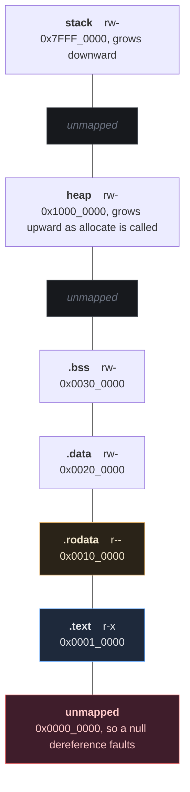
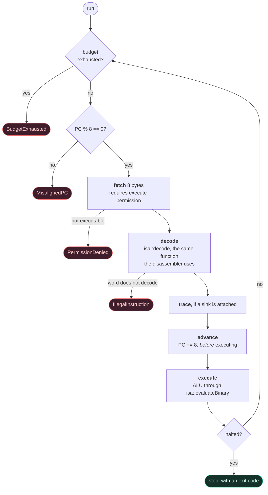

# The virtual machine

The VM executes a `.mexe` image. It understands executables and nothing
else — no source, no objects, no relocations (architectural rule 6).

```
minitool run program.mexe
minitool run program.mexe --trace
minitool run program.mexe --max-instructions 1000000
```

## 1. State

```cpp
struct CPUState {
    std::array<u64, 16> registers;   // R0-R15
    u64 pc;                          // always 8-byte aligned
    u64 sp;                          // grows downwards
    u64 flags;                       // ZF SF CF OF, see isa.md §5
    bool halted;
    u64 instruction_count;
    u64 exit_code;
};
```

Everything starts at zero except `PC`, set to the entry point, and `SP`,
set to the top of the stack. There is no uninitialised state to depend
on, so a program's behaviour is a function of its own bytes.

## 2. Memory

Flat, byte-addressable, no paging. The layout is in
[ADR-011](adr/ADR-011-runtime-abi.md); briefly:

| Region | Base | Permissions |
|---|---|---|
| `.text` | `0x0001_0000` | `r-x` |
| `.rodata` | `0x0010_0000` | `r--` |
| `.data` | `0x0020_0000` | `rw-` |
| `.bss` | `0x0030_0000` | `rw-` |
| heap | `0x1000_0000` | `rw-` |
| stack | `0x7FFF_0000`, growing down | `rw-` |



High addresses at the top. The gaps are not padding — they are genuinely
unmapped, so running off the end of one region faults instead of quietly
arriving in the next.

A region is a base, a size, a permission set and a byte vector. Every
access is bounds- and permission-checked, and an access that starts
inside one region and would run past its end is rejected rather than
spilling into the next — adjacent regions are still separate regions.

Nothing is mapped at address 0, so a null dereference faults.

Data accesses need not be aligned; instruction fetch must be, and the VM
checks `PC % 8` before fetching.

## 3. The instruction cycle



`PC` advances *before* execution, which is why `CALL` can push
`cpu.pc` — already the return address — and a branch simply overwrites
it.

Fetching requires execute permission, which is what stops a program
jumping into its own data; `Failure.ExecutingNonExecutableMemory` pushes
a `.data` address and returns to it.

Arithmetic goes through `isa::evaluateBinary` / `evaluateUnary`, the same
functions the optimizer's constant folder calls. There is exactly one
implementation of what `ADD` means, so the two cannot disagree — see
[optimizer.md](optimizer.md) §5.

## 4. Runtime errors

Every failure is a structured error carrying the faulting `PC`, never a
host-level crash:

| Error | Raised when |
|---|---|
| `INVALID_MEMORY_ACCESS` | unmapped address, or an access past a region's end |
| `PERMISSION_VIOLATION` | write to `r--`, execute from `rw-`, read from a region without `r` |
| `ILLEGAL_INSTRUCTION` | undecodable word, or a misaligned `PC` |
| `DIVISION_BY_ZERO` | `DIV` or `MOD` with a zero divisor |
| `STACK_OVERFLOW` | `PUSH`/`CALL` past the bottom of the stack |
| `STACK_UNDERFLOW` | `POP`/`RET` with `SP` at the stack top |
| `SYSCALL_ERROR` | unknown number, bad descriptor, buffer outside memory |
| `BUDGET_EXHAUSTED` | the instruction budget ran out |

A memory fault just below the stack limit is reported as
`STACK_OVERFLOW` rather than "unmapped address", because that is what it
almost always is.

## 5. The instruction budget

`run()` takes a budget, 100 million by default. It is not a timeout — it
is deterministic, so the same program always stops at the same
instruction. It exists so that "malformed input must never hang" is
testable: `Fuzz.VmSurvivesRandomCodeWithoutHangingOrCrashing` fills a
segment with random words and runs each one under a budget.

`minitool run --max-instructions N` exposes it.

## 6. Syscalls

Four services, specified in [ADR-011](adr/ADR-011-runtime-abi.md):
`exit`, `write`, `read`, `allocate`. The number is encoded in the
instruction, so a disassembly shows which services a program uses.

The host side sits behind `SyscallProvider`. The CPU's execution path
contains no host I/O; it builds a `SyscallContext` and hands it over.
Tests substitute a provider that captures output and supplies canned
input, which is why the VM tests can assert on a program's output without
touching a real file descriptor.

## 7. Tracing

```
$ minitool run program.mexe --trace
PC=0x0000000000010000  MOVI R1, 40
PC=0x0000000000010008  MOVI R2, 2
PC=0x0000000000010010  ADD R1, R2
PC=0x0000000000010018  CALL .+8
PC=0x0000000000010028  MOV R14, R1
PC=0x0000000000010030  RET
PC=0x0000000000010020  HALT
```

The sink is a `std::function` called before each instruction executes.
The debugger uses the same hook. Tracing costs roughly 25% throughput
(see [performance.md](performance.md)), which is why it is opt-in.

## 8. What the VM does not do

No interrupts, no privilege levels, no MMU, no threads, no self-modifying
code (no region is both writable and executable), and no host escape: a
program can reach exactly the memory its image asked for, plus the stack
and heap the loader added.
